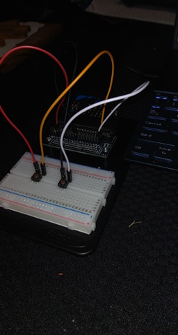
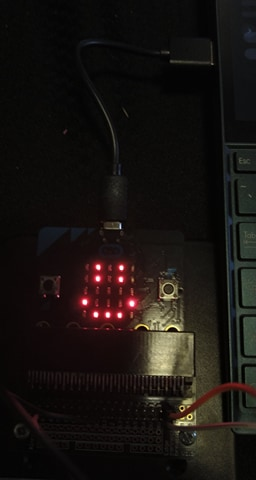
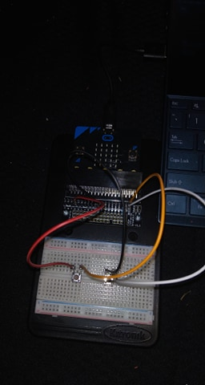
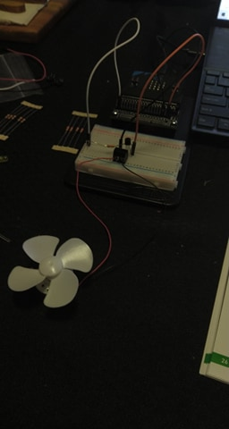
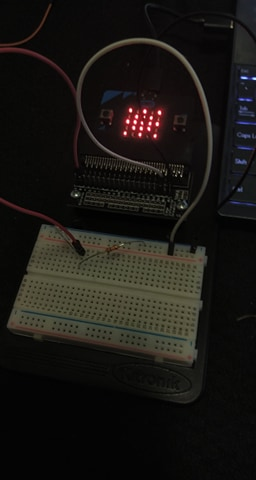
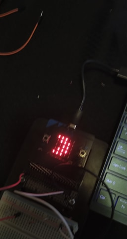
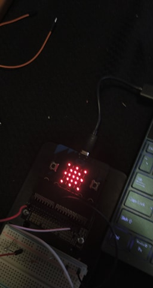
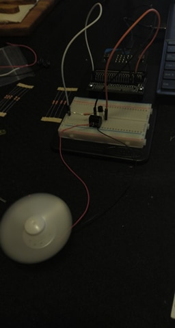
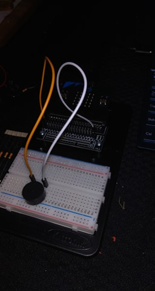
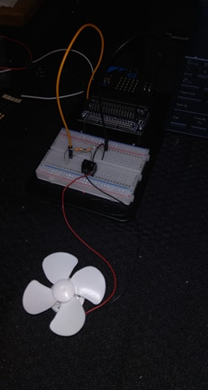

# Inventor Kit Experiments

*Markdown reference: https://guides.github.com/features/mastering-markdown/*

## Instructions ##

*For a selection of 5 inventor kit experiments that you choose, fill out the following sections.

### Experiment name ###

Experiment 1: Say "Hellow" To The BBC micro:bit!

#### Photo of completed project ####

 
 

1 & 3: Breadboard setup for experiment 1.
2 & 4: micro:bit LED output Display for experiment 1.

#### Experiment Code ####

```javascript
basic.forever(function () {
    input.onButtonPressed(Button.A, function () {
        basic.showLeds(`
            . . . . .
            . . . . .
            . . . . .
            . . . . .
            . . . . .
        `);

        basic.showLeds(`
            . # . # .
            . # . # .
            . . . . .
            # . . . #
            . # # # .
            `);

    })

    input.onButtonPressed(Button.B, function () {
        basic.showLeds(`
            . . . . .
            . . . . .
            . . . . .
            . . . . .
            . . . . .
        `);
        basic.showString("Hello world!");
    })
})
```

#### Reflection ####

In this experiment, I learned the method of display for the micro:bit and how the API interacts with it. The experiment also showed me the application specific functions such as input.onButtonPressed(), and conneting external buttons to be used for the A and B buttons. Learning these skills sets a foundation for interaction with the microbit for further projects and experiments. Because this is the first experiment, it is used to only show the basics of the micro:bit and has no real world application except for the fundamentals learnt to be applied later. In the code I added a blank display LED statement before each new display to clear the screen so it is not cluttered when the new pattern/word is displayed.

### Experiment name ###

Experiment 2: Using a Light Sensor & Analog Inputs

#### Photo of completed project ####

  

1: Breadboard Setup for experiment 2.

2 & 3: micro:bit LED Output Display for experiment 2.

#### Experiment Code ####

```javascript
let light = 0;
let lightValue = 200;

basic.forever(function () {
    light = pins.analogReadPin(AnalogPin.P0)

    if (light > lightValue) {
        basic.showLeds(`
            # . # . #
            . # # # .
            # # # # #
            . # # # .
            # . # . #
            `)
    } else {
        basic.showLeds(`
            # # # . .
            . # # # .
            . . # # .
            . # # # .
            # # # . .
            `)
    }
})

```

#### Reflection ####

In this experiment, I learnt the basics of how a phototransistor works, as well as the pins.analogReaedPin() function. Using this combined with the display fundamentals given in experiment 1, I was able to display the appropriate symbol on the LED scren when the light level was below a certain threshold. In the real world, this simple circuit and program could be used to activate lights based on ambient light levels, such as street lamps that turn on when it gets dark. In some cases this can be more reliable than a timer because as the year progresses sunset times will change. However it can be easily faulted and even manipulated if the phototransistor is covered. 

### Experiment name ###

Experiment 4: Using a Transistor to Drive a Motor

#### Photo of completed project ####

 

1 & 2: Fan speed dictated by transistor oscillation.

#### Experiment Code ####

```javascript
let duty = 0;

basic.forever(function () {
    while (duty < 1023) {
        pins.analogWritePin(AnalogPin.P0, duty);
        duty += 1;
        basic.pause(10);
    }
    while (duty > 0) {
        pins.analogWritePin(AnalogPin.P0, duty);
        duty -= 1;
        basic.pause(10);
    }
})

```

#### Reflection ####

In this experiment, transistors were introduced as a component. As well as this the pins.analogWritePin() function was introduced, allowing a signal to be sent from the pin to the circuit. Because the transistor was involved a number range could be used to vary the amount of current being sent from the board to the motor. Using this functionality and the built-in time system of the micro:bit, the fan could be oscillated over time from no speed to a high speed. Using this along with a temperature guage would allow a real world application of temperature control on a larger scale. The higher the temperature guage reads the more current is sent to the fan, therefore the faster the fan goes.

### Experiment name ###

Experiment 6: Setting The Tone With a Puezo Buzzer

#### Photo of completed project ####



The breadboard setup for experiment 6.

#### Experiment Code ####

```javascript
input.onButtonPressed(Button.AB, function () {
    music.beginMelody(music.builtInMelody(Melodies.Dadadadum), MelodyOptions.Once)
})
input.onButtonPressed(Button.A, function () {
    music.playTone(400, 500);
})
input.onButtonPressed(Button.B, function () {
    music.playTone(Note.C, music.beat(1));
})
```

#### Reflection ####

This experiment introduces the basics of creating tone and melody with a piezo buzzer. It familiarized me with the music.playTone() function, the music.beginMelody() function, and the provided music library. It combined this with the already taught input.onButtonPressed(). Like experiment 1, this is a fundamentals excercise and provides no real world application, but gives skills that can be applied to larger projects.

### Experiment name ###

Experiment 7: Wind Power

#### Photo of completed project ####



Breadboard setup for experiment 7.

#### Experiment Code ####

```javascript
let highest = 0;
let value = 0;

input.onButtonPressed(Button.A, function () {
    basic.showNumber(highest);
})

basic.forever(function () {
    value = pins.analogReadPin(AnalogPin.P0);
    if (value > highest)
        highest = value;
})

```

#### Reflection ####

The final experiment uses skills learnt before (such as the analog read pin and motor connection.) to read the voltage produced from moving the flan blades manually. When the blades were moved (by touch or by being blown on), the analog digital converter input on Pin0 measured the power gernerated by it and recorded the highest value. This value was then displayed on the LED screen when button A was pressed. This has many real world applications such as water flow and wind speed but the most direct connection would be to wind turbines and measuring their voltage output as report for green energy production.
