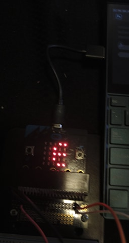

# Inventor Kit Experiments

*Markdown reference: https://guides.github.com/features/mastering-markdown/*

## Instructions ##

*For a selection of 5 inventor kit experiments that you choose, fill out the following sections.

### Experiment name ###

Experiment 1: Say "Hellow" To The BBC micro:bit!

#### Photo of completed project ####

 
 

1 & 3: Breadboard setup for experiment 1.
2 & 4: micro:bit LED output Display for experiment 1.

#### Experiment Code ####

```javascript
basic.forever(function () {
    input.onButtonPressed(Button.A, function () {
        basic.showLeds(`
            . . . . .
            . . . . .
            . . . . .
            . . . . .
            . . . . .
        `);

        basic.showLeds(`
            . # . # .
            . # . # .
            . . . . .
            # . . . #
            . # # # .
            `);

    })

    input.onButtonPressed(Button.B, function () {
        basic.showLeds(`
            . . . . .
            . . . . .
            . . . . .
            . . . . .
            . . . . .
        `);
        basic.showString("Hello world!");
    })
})
```

#### Reflection ####

In this experiment, I learned the method of display for the micro:bit and how the API interacts with it. The experiment also showed me the application specific functions such as input.onButtonPressed(), and conneting external buttons to be used for the A and B buttons. Learning these skills sets a foundation for interaction with the microbit for further projects and experiments. Because this is the first experiment, it is used to only show the basics of the micro:bit and has no real world application except for the fundamentals learnt to be applied later. In the code I added a blank display LED statement before each new display to clear the screen so it is not cluttered when the new pattern/word is displayed.

### Experiment name ###

Experiment 2: Using a Light Sensor & Analog Inputs

#### Photo of completed project ####

  

1: Breadboard Setup for experiment 2.

2 & 3: micro:bit LED Output Display for experiment 2.

#### Experiment Code ####

```javascript
let light = 0;
let lightValue = 200;

basic.forever(function () {
    light = pins.analogReadPin(AnalogPin.P0)

    if (light > lightValue) {
        basic.showLeds(`
            # . # . #
            . # # # .
            # # # # #
            . # # # .
            # . # . #
            `)
    } else {
        basic.showLeds(`
            # # # . .
            . # # # .
            . . # # .
            . # # # .
            # # # . .
            `)
    }
})

```

#### Reflection ####

In this experiment, I learnt the basics of how a phototransistor works, as well as the pins.analogReaedPin() function. Using this combined with the display fundamentals given in experiment 1, I was able to display the appropriate symbol on the LED scren when the light level was below a certain threshold. In the real world, this simple circuit and program could be used to activate lights based on ambient light levels, such as street lamps that turn on when it gets dark. In some cases this can be more reliable than a timer because as the year progresses sunset times will change. However it can be easily faulted and even manipulated if the phototransistor is covered. 

### Experiment name ###

Experiment 4: Using a Transistor to Drive a Motor

#### Photo of completed project ####
In the code below, replace imagemissing.jpg with the name of the image, which should be in the kitexperiments folder.

 

(Insert a caption here)

#### Reflection ####

In this experiment, something new to me was or something I learned was (insert something here).

This experiment could be the basis of a real world application such as (insert something here).

### Experiment name ###

(Replace this with the experiment name)

#### Photo of completed project ####
In the code below, replace imagemissing.jpg with the name of the image, which should be in the kitexperiments folder.


(Insert a caption here)

#### Reflection ####

In this experiment, something new to me was or something I learned was (insert something here).

This experiment could be the basis of a real world application such as (insert something here).

### Experiment name ###

(Replace this with the experiment name)

#### Photo of completed project ####
In the code below, replace imagemissing.jpg with the name of the image, which should be in the kitexperiments folder.


(Insert a caption here)

#### Reflection ####

In this experiment, something new to me was or something I learned was (insert something here).

This experiment could be the basis of a real world application such as (insert something here).

