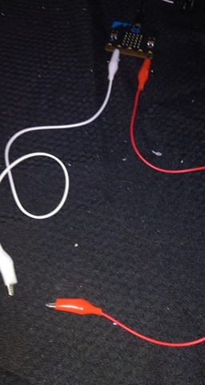

# Assessment 1: Replication project

*Fill out the following workbook with information relevant to your project.*

*Markdown reference:* [https://guides.github.com/features/mastering-markdown/](http://guides.github.com/features/mastering-markdown/)

## Replication project choice ##
### Timing Gates ###
https://makecode.microbit.org/projects/timing-gates

## Related projects ##

### Related project 1 ###
#### Infrared Timing Gate ####

https://bigl.es/micro-bit-infrared-timing-gate/


This project is related to mine because it starts with the same project, then advances it to a far higher level. The project finalises by using infrared sensors to record the start and end of the timing as apposed to a crude electrical circuit to record these events.

### Related project 2 ###
#### Wireless Laser Gate ####

https://create.arduino.cc/projecthub/Pablerdo/wireless-laser-gate-timing-system-for-track-and-field-ba8cd9


This project is related to mine because it is also a timing gate, however instead of using basic electrical circuits, it uses lasers and LDRs or *photoresistors*. As well as this, the project employs tranceivers, and is built on the Arduino Uno platform, allowing the different gate modules to be wireless.

### Related project 3 ###
#### Traffic Light System ####

https://www.hackster.io/anish78/traffic-light-system-using-bbc-micro-bit-da2f47


This project is related to mine because it could be used in conjunction with the timing gate system. In principle, if the timing gates were used on the road, the traffic lights could be used as a system to limit the inflow of traffic between the two gates, allowing one car to pass over both gates before the next care is allowed through.

### Related project 4 ###
#### Microfootball ####

https://make.techwillsaveus.com/microbit/activities/microfootball


This project is related to mine because it uses the same principal of connection to trigger an event. When the back of the net (covered in aluminium foil) touches the other foil plate, the connection is completed and the micro:bit reads an input to one of its pins, in turn triggering an event in the code. This is the same system used on the timing gates project where the object crossing the gates completes the connection of the first circuit. 

### Related project 5 ###
#### Frustration ####

https://projects.raspberrypi.org/en/projects/frustration


This project also uses the concept in fabrication of completing a circuit to trigger an event. The frustration game is a widely popular board game where when a wand is passed over a wire and every time connection is made, a buzzer is signaled.

## Reading reflections ##
### Reading: Don Norman, The Design of Everyday Things, Chapter 1 (The Psychopathology of Everyday Things) ###

*What I thought before:* 

As a whole, design to me never seemed like a necessary step as long as the finished product worked. Discoverability and understanding were often afterthoughts of my design work instead of being one of the most important points like it should be.

*What I learned:*

Discoverability and understanding are the most important attribute of design. Even if the finished product works as it should, it's useless if nobody can understand how to achieve the intent of the product. Deciding on these important points early on effects the entire design process and can change key points in the product's construction.

*What I would like to know more about: Describe or write a question about something that you would be interested in knowing more about.*

Why do engineers and product designers that have not studied human behaviour think that their first assumption is correct? When designing something you have to think about giving it to someone from a different world that has no background knowledge and therefore needs their hand held every step of the interaction. But then when products designed, the experts on the products just assume that it's straight forward, this seems strange to me.

*How this relates to the project I am working on:*

If someone who is unfamiliar with the project needs to use it, they need to almost instantly understand their task and how to complete it. An important part of making this clear is instant feedback such as visual cue and/or audio cue. This further pushed my already seeded idea to include the LEDs that come with the micro:bit as well as the piezo buzzer to give realtime feedback to the operation of the product.

### Reading: Chapter 1 of Dan Saffer, Microinteractions: Designing with Details, Chapter 1 ###

*What I thought before:* 

I believed that microinteractions were trivial, unimportant things when designing a product that's main purpose is to be interacted with.

*What I learned:*

That smaller interactions that are often forgettable take part in the overall experience of a product and should be important parts of focus in design phases. Accomplishing simple tasks often works together to accomplish a larger task, but when each microinteraction is tedious and/or broken, the user will quikcly become confused and angry.

*What I would like to know more about:*

It would be interesting to dive deeper into how microinteractions effect user experience overall as well as common design processes that cover the smaller interactions.

*How this relates to the project I am working on:*

This relates to my project in the sense that the two main points of interaction are microinteractions (rolling the car over the two gates). If this was overcomplicated or provided no feedback than the interaction would be dull and boring and would sour the overall experience of the user

### Reading: Scott Sullivan, Prototyping Interactive Objects ###

*What I thought before:* 

Design is an extremely niche job area that only certain people will be able to understand.

*What I learned:*

The growing amount of technology and new generations allows an influx of designers that are natively comfortable with technology. Already being comfortable in the area allows them to prototype things quickly and efficiently with personal experience that improves the design catered to other people.

*What I would like to know more about:*

I would like to more about the step by step process that goes into prototyping a product and the different stages if creation that it goes through.

*How this relates to the project I am working on:*

Prototyping is an important stage in any project as continuity and consistency of function needs to be upheld through different iterations of the product.


## Interaction flowchart ##
*Draw a flowchart of the interaction process in your project. Make sure you think about all the stages of interaction step-by-step. Also make sure that you consider actions a user might take that aren't what you intend in an ideal use case. Insert an image of it below. It might just be a photo of a hand-drawn sketch, not a carefully drawn digital diagram. It just needs to be legible.*


## Process documentation ##

*In this section, include text and images that represent the development of your project including sources you've found (URLs and written references), choices you've made, sketches you've done, iterations completed, materials you've investigated, and code samples. Use the markdown reference for help in formatting the material.*

*There will likely by a dozen or so images of the project under construction. The images should help explain why you've made the choices you've made as well as what you have done. Use the code below to include images, and copy it for each image, updating the information for each.*


I first started by completing the basic instructions provided in the project's outline. I used alligator clips attatched directly to the micro:bit so that I could easily make connection and see the output of the LED screen. The clip in the image is connected ti P1 so that I could test whether or not other pins would work in place of P0, this came in handy not long after in the project's construction. At this point the code was as shown below:

```javascript
let t1 = 0;
let t0 = 0;

basic.forever(function () {
    input.onPinPressed(TouchPin.P1, function () {
        t0 = control.eventTimestamp();
        basic.showLeds(`
            # . . . .
            # . . . .
            # . . . .
            # . . . .
            # . . . .
        `);
    })
    input.onPinPressed(TouchPin.P2, function () {
        t1 = control.eventTimestamp();
        basic.showLeds(`
            # . . . #
            # . . . #
            # . . . #
            # . . . #
            # . . . #
        `);
        //Recorded in microseconds, divide by 1 000 000 to convert to milliseconds
        let time = (t1 / 1000000) - (t0 / 1000000)
        basic.showString(time.toString());
    })
})
```


After this I connected the micro:bit to the breadboard dock so that I could integrate the use of LEDs. Green and red were used because they are most often connected to 'stop' and 'go', or 'standby' and 'complete' as they are in this case. I used the green and red wires connected as shown to touch against the brown wire which was connected to ground. This allowed me to test connection of the gates with out plugging things in and out constantly.


After adding the LEDs to the breadboard I added the piezo buzzer to provide audio feedback to the user when each gate is crossed. At this stage I was still using pin wires to test connections before the gates were built. This would be one of the last iterations of the breadboard before the final product as it had all needed functionality.


The only things different after the third iteration with the speaker were the adition of two gate wires running along the positive and negative strips of the breadboard. This allowed me to connect the clip wires on the edge and gave me extra length, which was needed to reach the gates. As well as this a ground wire was routed from one of the LEDs to an alligator clip that would then be wplit off to both gates. 


The gates are simple: two pieces of aluminium foil at each gate for positive and negative connection. When these two pieces are linked by the car, the circuit of the first gate is complete and the signal is sent to the micro:bit. This then carries out its function as defined above and waits for the next input at the second gate.


The car is a small toy truck with aluminium foil connecting the two wheel axes. This allows constant contact with the ground and enough surface area to effectively link the gate terminals at any point along it's travel.


The final layout of the breadboard at time of iteration.

### Circuit Diagram ###


## Project Code ##

The project's code is rather simple and does not involve unnecessary repetions in lines. Most of the space taken up in it is from the basic.showLeds() function that essentially takes 5 lines every time it's used. It is used twice more than absolutely **necessary** but it helps keep the LED display clear and readable which provides a more smooth and satisfying interaction with the product.

```javascript
let distance = 1;
let t1 = 0;
let t0 = 0;

pins.digitalWritePin(DigitalPin.P8, 0);
pins.digitalWritePin(DigitalPin.P12, 0);

basic.showLeds(`
    . . . . .
    . . . . .
    . . # . .
    . . . . .
    . . . . .
`);

basic.forever(function () {
    input.onPinPressed(TouchPin.P1, function () {
        pins.digitalWritePin(DigitalPin.P8, 1);
        music.playTone(622.25, 100);
        t0 = control.eventTimestamp();
        basic.showLeds(`
            # . . . .
            # . . . .
            # . . . .
            # . . . .
            # . . . .
        `);
    })
    input.onPinPressed(TouchPin.P2, function () {
        pins.digitalWritePin(DigitalPin.P12, 1);
        music.playTone(415.30, 100);
        t1 = control.eventTimestamp();
        basic.showLeds(`
            # . . . #
            # . . . #
            # . . . #
            # . . . #
            # . . . #
        `);
        //Recorded in microseconds, divide by 1 000 000 to convert to milliseconds
        let time = (t1 / 1000000) - (t0 / 1000000)
        basic.showLeds(`
            . . . . .
            . . . . .
            . . . . .
            . . . . .
            . . . . .
        `);
        //distance / time
        let velocity = distance / time;
        console.log(time.toString());
        let velString = velocity.toString().slice(0, 4);
        console.log(velString);
        basic.showString(velString + "m/s");

        basic.pause(100);
        pins.digitalWritePin(DigitalPin.P8, 0);
        pins.digitalWritePin(DigitalPin.P12, 0);
        basic.showLeds(`
            . . . . .
            . . . . .
            . . # . .
            . . . . .
            . . . . .
        `);
    })
})
```

# Project outcome #

## Speed from Timing Gates ##

### Project description ###

This project is a simlpe system that records the time it takes to travel between two points and calculates the speed. Typically, this system would be used on roads to record time between to road points by vehicles. When the first gate is passed the red light will turn on, signalling that timing is in progress, and a tone will be played. When passing the second gate, the green light will turn on, signalling that the process is complete, and a different tone will be played. The speed of the vehicle will then be dispayed on the LED screen in metres per second.

### Showcase image ###

*Try to capture the image as if it were in a portfolio, sales material, or project proposal. The project isn't likely to be something that finished, but practice making images that capture the project in that style.*


### Additional view ###

*Provide some other image that gives a viewer a different perspective on the project such as more about how it functions, the project in use, or something else.*


### Reflection ###

*Describe the parts of your project you felt were most successful and the parts that could have done with improvement, whether in terms of outcome, process, or understanding.*

The most succesful part of the project was the software iteration itself. After simple iterations of the orignal gates concept, provided with instructions, it was extremely easy to add extra functionality afterwards such as the LEDs and buzzer. All these added features required was a short search in the documentation to find which pins worked best for activating the LEDs.

Ideally with more time, which I may have had if I wasn't sick, I could have made a cleaner and more aesthetically pleasing final product on the construction side of things (hidden wires, presented LEDs etc). But with all necessary components visible as well as a relatively clean look I think that it is sufficient, especially considering its reliability.

*What techniques, approaches, skills, or information did you find useful from other sources (such as the related projects you identified earlier)?*


*What ideas have you read, heard, or seen that informed your thinking on this project? (Provide references.)*


*What might be an interesting extension of this project? In what other contexts might this project be used?*
